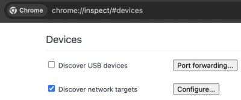
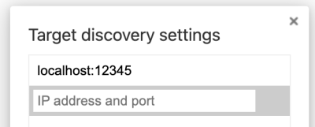
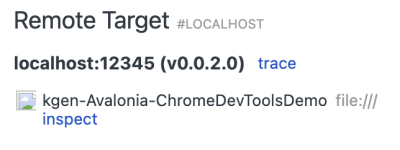
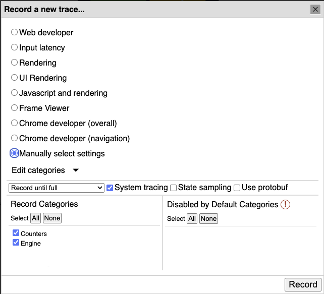
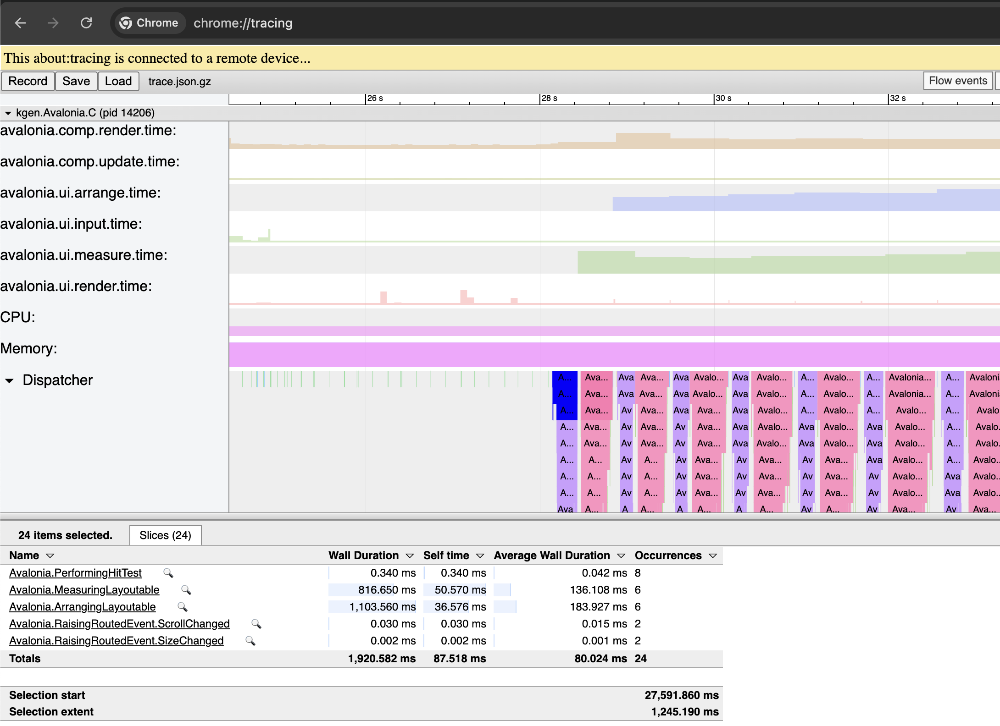
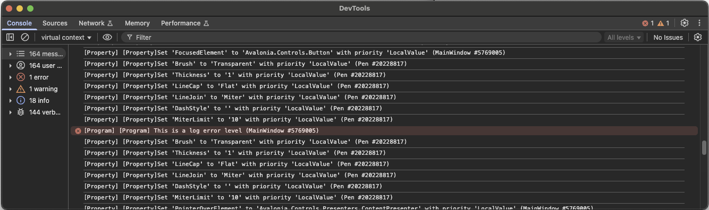

# Avalonia Demo for Chrome Dev Tools Connector

You can contact us direction  at [tech@kgen-llc.com](mailto:tech@kgen-llc.com) for more information
or use [https://github.com/kgen-llc/ChromeDevTools.Connectors](https://github.com/kgen-llc/ChromeDevTools.Connectors) to raise issues and/or find extra documentation.

Note the application has been tested on Desktop platform only, Windows, Mac and Linux (Debian).
It is provided for both .net 8 and .net 9 runtime.

## Introduction

This demo will showcase how to use the Chrome Dev Tools Connector to trace an AVALONIA application effectively.
It mainly demos two key features:

* redirecting display the AVALONIA logging function into the Chrome Web Browser console.
* showing AVALONIA activities and meters in the chrome trace

In order to have interesting trace and activity, we are re-using one of the sample provided by the Avalonia team.

## Steps

### **Step One** - install and run the sample

Easy, use the dotnet tool - so yes, you must have a configured .net environment.

```> dotnet tool install -g kgen.Avalonia.ChromeDevToolsDemo```

and then from a command line, simply use

```> kgen.avalonia.chromedevtools```

And that's it !

There is more information embedded into the application itself

### **Step Two** - configure the target  in the chrome://inspect window (only once)

1. Open the chrome://inspect page  
  

2. Open the configure windows to add a new remote target localhost:12345  
  

3. A new remote target should appears !  
  

### **Step Three** - connect using the trace button then record

When recording, there is current limitation, you MUST select 'record until full' into the window, the other modes are not implemented yet.
You can also select which record categories you are interested in:

* Counters - will record Avalonia Meters and some basic DotNet Counters
* Engine - will record Avalonia Activities



You should be able to see a regular trace with the different events (rendering, layout, etc..) and meters.

We recommend you to save your trace and shared it with someone else to be loaded again in chrome://tracing environment or even in [https://ui.perfetto.dev](https://ui.perfetto.dev/)


The intent of this is to demo that you can simply record any trace activities on any computer you have your application running and do some offline analysis and/or on a different computers !


_Note: you can simply lot one of the samples, <https://raw.githubusercontent.com/kgen-llc/ChromeDevTools.Connectors/refs/heads/dev/avalonia/demo-app/avalonia-app-example.json> directly in [https://ui.perfetto.dev](https://ui.perfetto.dev/)_

### **Step Four** - connect using the inspect button and check for the Avalonia Logs

By using the inspect button, you can see the logs emitted by Avalonia appearing into the inspect window.
You can use the three buttons into the Avalonia application to highlight the different severity messages.
Feel free to use the filter button to look at what is interesting for you !


